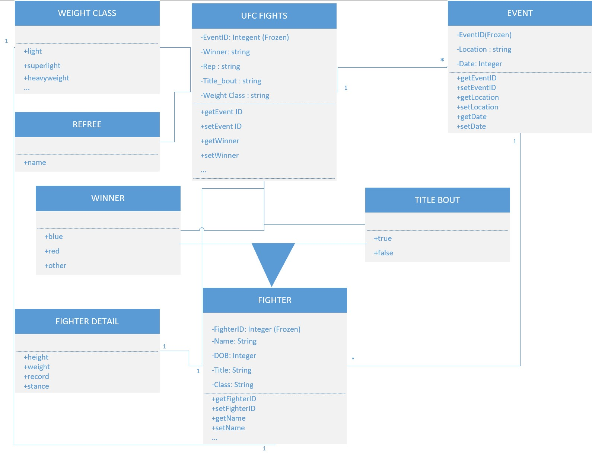
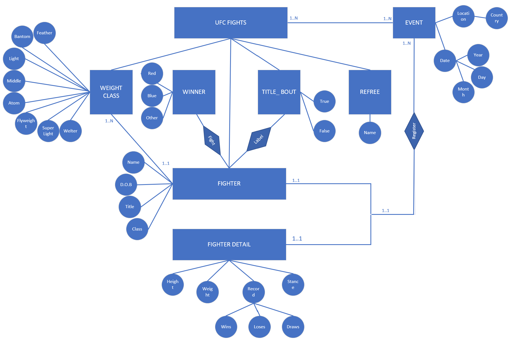
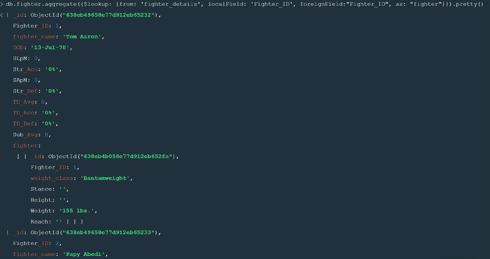
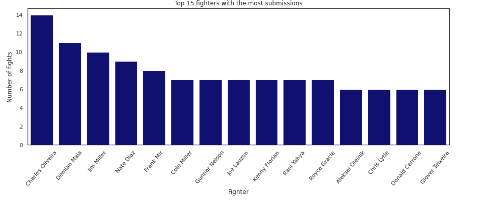

# UFC Fight Data Pipeline Project

[](https://www.python.org/) [](https://airflow.apache.org/) [](https://www.sqlite.org/) [](https://www.mongodb.com/)

End-to-end UFC data engineering capstone using Python, Apache Airflow, SQL, MongoDB, and data visualization to transform raw fight records into validated analytical outputs.

## Overview

This project ingests historical UFC fight data, cleans and transforms it, builds a gold summary layer, loads the curated data into SQLite, and validates the final outputs. It also includes exploratory analysis, MongoDB queries, and relational schema design for a complete portfolio-ready data project.

## Project Demo









The visuals above show the data model, database design, MongoDB querying, and one of the analytical charts produced in the project.

## Highlights

- Airflow ETL pipeline for local orchestration.
- Raw, silver, and gold data layers.
- SQLite load and validation checks.
- MongoDB examples for filtering, aggregation, and lookup.
- SQL schema design and database modeling.
- Notebook-based analysis and visualizations.

## Pipeline Flow

The Airflow DAG runs these steps in order:
1. Ingest raw data.
2. Transform it into a cleaned dataset.
3. Build a gold summary dataset.
4. Load the silver layer into SQLite.
5. Validate the final outputs.

The DAG was verified successfully with `airflow dags test ufc_pipeline_dag 2026-04-27`.

## Getting Started

```bash
git clone <your-repo-url>
cd UFC-Fight-Data-Pipeline-Project
python -m venv .venv
source .venv/bin/activate
pip install -r requirements.txt
airflow dags test ufc_pipeline_dag 2026-04-27
```

## Output Files

Running the pipeline creates these files in `output/`:

- `output/raw_fights.csv`
- `output/transformed_fights.csv`
- `output/gold_fighter_summary.csv`
- `output/validated_fights.csv`

The validation file contains 3 rows with the expected columns: `fight_id`, `fighter`, `opponent`, `result`, and `is_win`.

## Analysis and Modeling

The project includes:

- UFC fight trend analysis in a Jupyter notebook.
- MongoDB collection exploration, filtering, regex queries, and `$lookup` joins.
- SQL table design and relational schema work.
- Diagrams and screenshots supporting the data model and analysis.

## Repository Layout

```text
UFC Fight Data Pipeline Project/
├── dags/
│   └── ufc_pipeline_dag.py
├── data/
│   ├── ufc.db
│   ├── raw/
│   ├── silver/
│   └── gold/
├── docs/
├── images/
├── output/
├── presentations/
├── queries/
├── scripts/
├── sql/
├── check_tables.py
├── config.py
├── logging_config.py
├── requirements.txt
├── README.md
└── .gitignore
```

## Notes

- `scripts/` contains the executable pipeline code.
- `queries/` contains SQL and MongoDB query files.
- `docs/`, `images/`, and `presentations/` contain project deliverables.
- Generated files in `output/` are created by the pipeline and should be treated as artifacts.