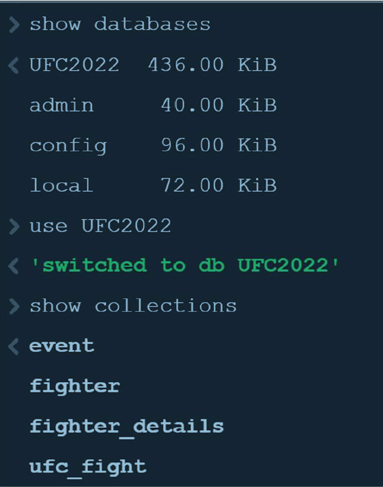
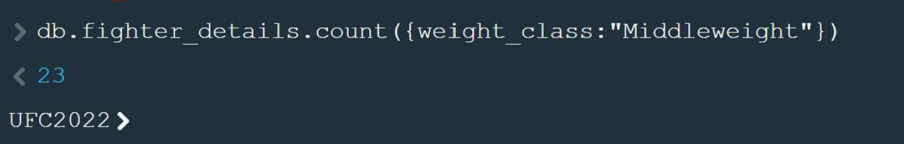
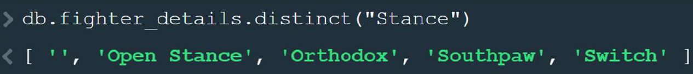
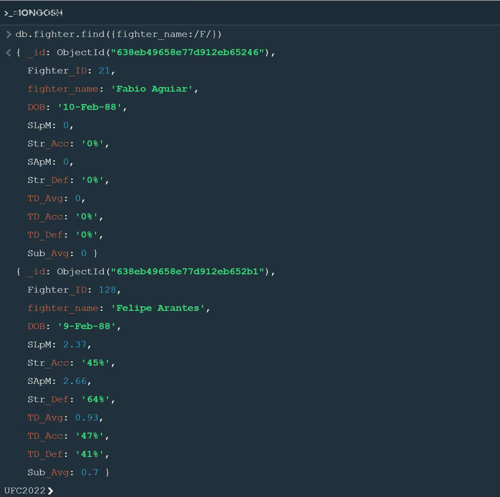
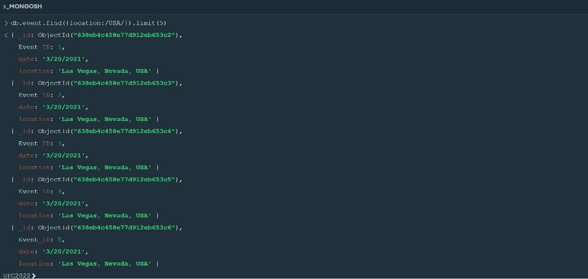
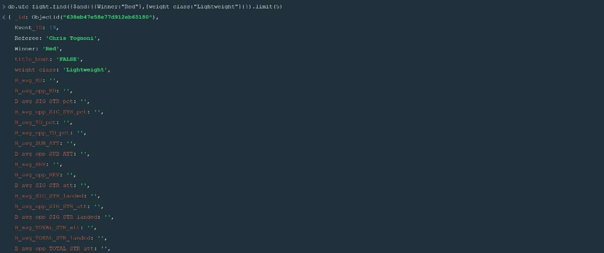
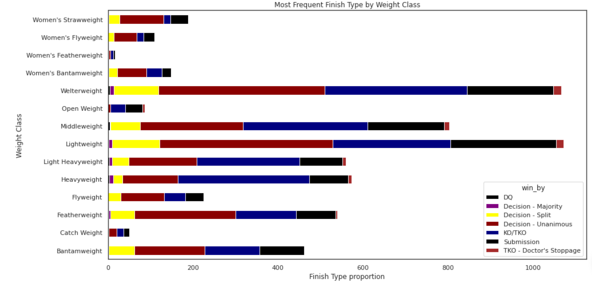

# UFC Fight Capstone

This project analyzes historical UFC fight data from 1993 to 2021 using SQL, MongoDB, Python, and database design artifacts. It combines a Jupyter notebook, a case study report, a NoSQL milestone, schema diagrams, an SQL source file, and a presentation into one organized repository.

## Overview

The goal of this project is to study how UFC fighting styles and fight outcomes evolved over time. The analysis focuses on submissions, knockout trends, takedowns, finish types by weight class, and fighter-level performance patterns.

## Dataset

The dataset comes from the UFC historical fight data published on Kaggle by Rajeev Wagh and covers fights from 1993 through March 2021.

## Project files

| File | Description |
| --- | --- |
| `UFC-Fight-Data-1993-2021-1.ipynb` | Main analysis notebook. |
| `docs/milestone-4-5.md` | Cleaned MongoDB milestone queries and explanations. |
| `docs/case-study-report.md` | Case study report. |
| `queries/mongodb-queries.js` | MongoDB query file. |
| `schema/EER-Fight.jpg` | EER diagram. |
| `schema/UML.jpg` | UML diagram. |
| `schema/UFC.sql` | SQL source file. |
| `presentations/UFC-FIGHT-ANALYSIS.pdf` | Project presentation. |

## Database design

The project is organized around four main entities:

- `fighter`
- `fighter_details`
- `event`
- `ufc_fight`

The EER and UML diagrams show how these entities are related through shared identifiers such as `Fighter_ID` and `Event_ID`.

The SQL source file shows the original wide-table structure of the UFC data, while the MongoDB work reorganizes the data into smaller logical collections for querying and lookup operations.

## SQL work

The SQL portion of this project was developed and tested in MySQL Workbench to explore relationships between fighters, fight details, and events.

Examples shown in the presentation include:

- joining `fighter` with `fighter_details`,
- joining `ufc_fight` with `event`,
- and filtering for fighters in southpaw stance with weight over 200 lbs.

## MongoDB work

The NoSQL portion of the project was completed in MongoDB using aggregation and `$lookup` to compare fighter, fight, and event data across collections.

The NoSQL milestone demonstrates:

- counting documents,
- finding distinct values,
- regex-based filtering,
- conditional filtering,
- and joining collections with `$lookup`.

## Python analysis

The notebook includes Python-based analysis for exploring the UFC dataset. The analysis looks at:

- yearly fight counts,
- finish type trends over time,
- fighter submission counts,
- and finish type distribution by weight class.

The presentation includes visualizations such as:

- Most Frequent Finish Type by Weight Class,
- Top 15 Fighters with the Most Submissions.

## Visual assets

### Schema


### Analysis screenshots

















## Repository structure

```text
UFC-Fight-Capstone/
├── README.md
├── UFC-Fight-Data-1993-2021-1.ipynb
├── docs/
│   ├── milestone-4-5.md
│   ├── case-study-report.md
│   └── powershell-github-steps.md
├── queries/
│   └── mongodb-queries.js
├── schema/
│   ├── EER-Fight.jpg
│   ├── UML.jpg
│   └── UFC.sql
├── presentations/
│   └── UFC-FIGHT-ANALYSIS.pdf
└── images/
    ├── mongodb-show-dbs.png
    ├── mongodb-count-middleweight.png
    ├── mongodb-distinct-stance.png
    ├── mongodb-fighter-f-query.png
    ├── mongodb-usa-events.png
    ├── mongodb-lightweight-red.png
    ├── mongodb-lookup-fighter-event.png
    ├── chart-weight-class-finish-type.png
    └── chart-top-submissions.png
```